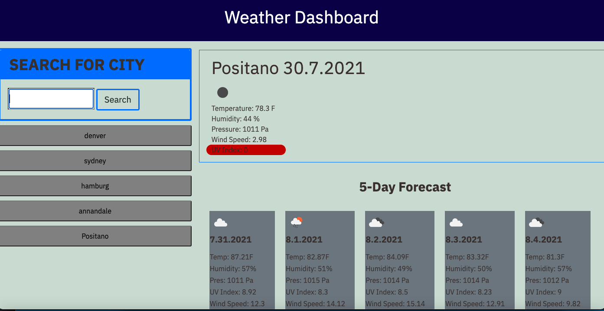

## Open-Weather-Weather-Forecast

# The Repository
The intent of the Code Repository("Open-Weather-Weather-Forecast") was to create a Weather Dashboard with the use of Open Weather API. The Weather Dashboard includes the Functionality to search a city, and this will prompt a current weather detail box, as well as a 5 day forecast which includes, Humidty, wind speed, UV Index, and Pressure. 

I also utilize the use of localStorage where, once you search a city that city goes into localStorage and is from that point saved underneath the Search bar. 

During this project I ran into a few difficulties, that were resolved during the process. I had some isssues with my saved buttons at first where they werent displaying correctly the current box and the 5 Day Forecast.This was resolved after a few days, of debuggin. I also ran into an issue with the UV Index, where I was appending it everytime it was duplicating. This was also resolved, by removing coding the div for this element dynamically in the code, and adding it to the html instead. 

# Contributors
No student Contributors in this course. 

# Finished Website Layout

# Deployed WebPage Location
https://kamm8899.github.io/Open-Weather-Weather-Forecast/